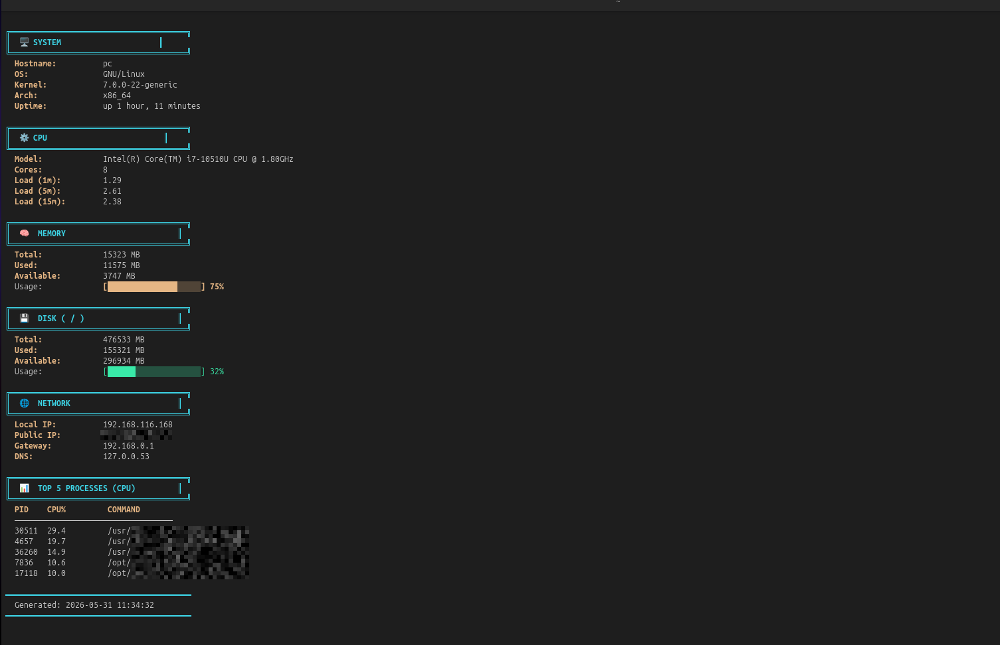

# System Information Dashboard

A beautiful and colorful Dashboard displays a live os summary in terninal using bash scripting

## Screenshot




## Features of Script

- CPU model , num of cores , and load average.
- Memory info with a colorful progress bar.
- Disk usage with a progress bar.
- Network information like (private ip , public ip ,etc).
- Display top processes by CPU.

## Usage 

```bash
chmod +x systeminfo.sh
./systeminfo.sh
```

## Requirements
- Linux OS or MacOS.
- curl tool for getting public ip